[portfolio](https://abdullahioriola.vercel.app) &nbsp;·&nbsp;
[linkedin](https://www.linkedin.com/in/abdullahi-oriola-63459b2a7) &nbsp;·&nbsp;
[x / twitter](https://twitter.com/Astro2theworld) &nbsp;·&nbsp;
[email](mailto:abdullahioriola02@gmail.com)

> Full-stack developer in Lagos, Nigeria. Data Science student at UNILAG. 
> I build for real problems, not demo days.

Self-taught since July 2023. I ship AI-powered products across healthtech, 
fintech, edtech, and SME tools. Currently interning at BRTGC, building 
[AuraEstate](https://github.com/Astronomox/auraestate) — a multi-tenant real estate SaaS.

<samp>python &nbsp; typescript &nbsp; javascript &nbsp; next.js &nbsp; react &nbsp; fastapi &nbsp; django &nbsp; node &nbsp; supabase &nbsp; firebase &nbsp; postgres &nbsp; docker</samp>

**[DermaFlow AI](https://dermaflow-zeta.vercel.app)** &nbsp;·&nbsp; <samp>next.js, python, gemini ai, grad-cam</samp> 
AI skin diagnostic platform addressing the cost barrier of dermatologist visits 
in Nigeria. Heatmap explainability, Bio-LLM chatbot, oncology triage.

**[VerifyAI](https://verifyai-hr.vercel.app)** &nbsp;·&nbsp; <samp>python, fastapi, isolation forest, squad api</samp> 
Payroll integrity platform that detects ghost workers pre-disbursement. 
Built for SquadHacks 3.0. Isolation Forest anomaly detection, escrow integration.

**[BizPadi](https://bizpadi.vercel.app)** &nbsp;·&nbsp; <samp>fastapi, python, whatsapp api, groq</samp> 
AI companion matching Nigerian SMEs to grants, loans, and support programmes 
entirely over WhatsApp. TEF, BOI, SMEDAN integration.

Every graphic here is generated, not embedded from anyone else's server. 
`ascii.svg` is a photo pushed through a character ramp by 
[`scripts/make_portrait.py`](scripts/make_portrait.py); the stat graphics and 
section headings are drawn by [a scheduled action](.github/workflows/stats.yml) 
straight from the GitHub GraphQL API, once a day, committing only what changed.

They animate with SMIL inside the SVG, because GitHub strips scripts from 
READMEs — and since nothing loads from a third party, nothing here can 
rate-limit or go dark.
